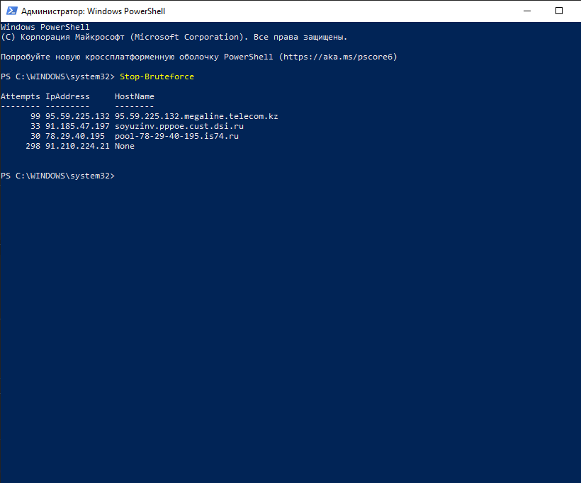

# PSStopBruteforce

The **PSStopBruteforce** modules to stop bruteforce attack on SMB, RDP and WinRm.

## Installation

### From Source

To manually install the module,
download the source code and unzip the contents to the directory
'$env:ProgramFiles\WindowsPowerShell\Modules' folder,  or
'$env:ProgramFiles\PowerShell\7\Modules' for Powershell 7.

## Requirements

* The minimum Windows Management Framework (PowerShell) version required is 5.1
or higher.
* Target machine must be running Windows Server 2012 R2 or later.

## List of commands
The following is a list of commands which are available for you to use once you follow the steps in Installation

|Command|Description|
|-------|-----------|
|[Stop-Bruteforce](/Stop-Bruteforce) |Read Windows Event Log, search for Audit Failure. Adds ip adresses of attackers to deny firewall rule.|
|[Get-Bruteforce](/Get-Bruteforce)  |Read Windows Event Log, search for Audit Failure and Audit success anonimous logon events. Return array of BruteStatistics.|
|[Protect-FromBruteforce](/Protect-FromBruteforce) |Read Windows Event Log, search for Audit Seccess. Add ip adresses of non anonimous users to default firewall rules.|
|[Unprotect-FromBruteforce](/Unprotect-FromBruteforce)  |Reset remote scope of default firewall rules for SMB, WinRM or RDP back to ANY.|

## Examples

You can review the  directory for some general use
scenarios for all of the resources that are in the module.

## Change log

A full list of changes in each version can be found in the [change log](CHANGELOG.md).

### 1.0.1

- Better naming for modules
- Remove redundant type casting

### 1.0.0

- Initial Commit
