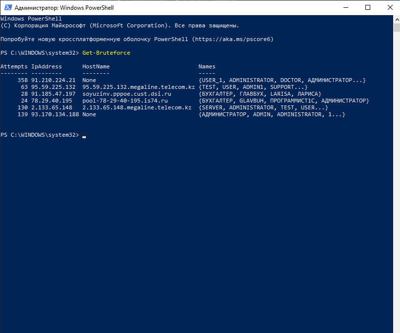

# PSStopBruteforce


The **PSStopBruteforce** modules to stop bruteforce attack on SMB, RDP and WinRm.


## Installation

### From Source

To manually install the module,
download the source code and unzip the contents to the directory for powershell 5.1:
```
$env:ProgramFiles\WindowsPowerShell\Modules
```

Or for Powershell 7:
```
$env:ProgramFiles\PowerShell\7\Modules
```


## Requirements

* The minimum Windows Management Framework (PowerShell) version required is 5.1
or higher.
* Target machine must be running Windows Server 2016 or later.

## List of commands and examples
The following is a list of commands which are available for you to use once you follow the steps in Installation

| Command                                                  |Description|
|----------------------------------------------------------|-----------|
| [Stop-Bruteforce](https://github.com/nneeoo/PSStopBruteforce/wiki/Stop-Bruteforce)                 |Read Windows Event Log, search for Audit Failure. Adds ip adresses of attackers to deny firewall rule.|
| [Get-Bruteforce](https://github.com/nneeoo/PSStopBruteforce/wiki/Get-Bruteforce)                     |Read Windows Event Log, search for Audit Failure and Audit success anonimous logon events. Return array of BruteStatistics.|
| [Protect-FromBruteforce](https://github.com/nneeoo/PSStopBruteforce/wiki/Protect-FromBruteforce)     |Read Windows Event Log, search for Audit Seccess. Add ip adresses of non anonimous users to default firewall rules.|
| [Unprotect-FromBruteforce](https://github.com/nneeoo/PSStopBruteforce/wiki/Unprotect-FromBruteforce) |Reset remote scope of default firewall rules for SMB, WinRM or RDP back to ANY.|

## Change log

A full list of changes in each version can be found in the [change log](CHANGELOG.md).
